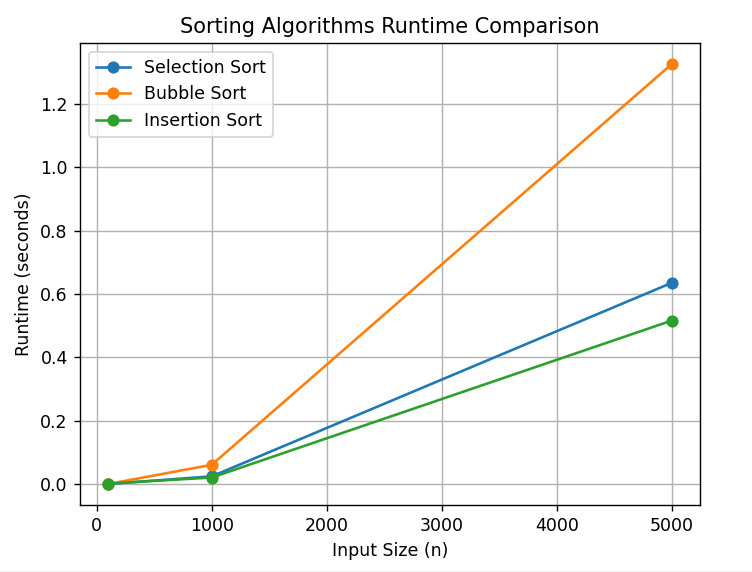

# Sorting Algorithms in Python

This repository provides clean implementations of classical and optimized sorting algorithms in Python.
It focuses on algorithm design, performance optimization, and runtime analysis.

---

## Algorithms Included

### 🔹 Basic Algorithms

* Selection Sort
* Bubble Sort
* Insertion Sort

### 🔹 Enhanced Algorithms

* Optimized Bubble Sort
* Enhanced Merge Sort (Hybrid approach)

### 🔹 Performance Analysis

* Runtime benchmarking
* Comparisons and swaps counting

---

## Features

* Clean and modular Python implementations
* Performance measurement and benchmarking
* Visualization using `matplotlib`
* Analysis of algorithm efficiency
* Optimized versions for better performance

---

## Usage Example

```python
from enhanced_sorts.enhanced_merge_sort import enhanced_merge_sort

arr = [12, 11, 13, 5, 6, 7]
enhanced_merge_sort(arr)
print(arr)
```

---

## Example Output

```
[5, 6, 7, 11, 12, 13]
```

---

## Project Structure

```
sorting-algorithms-analysis/
│
├── basic_sorts/
├── enhanced_sorts/
├── performance_analysis/
└── images/
```

---

## Goals

* Understand different sorting strategies
* Analyze algorithm complexity and performance
* Apply optimization techniques
* Write clean and professional Python code
---


## Author

imlouli abderrahmane (cyber security Engineering Student)
